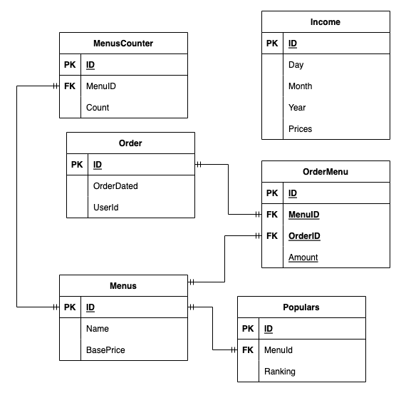

# Boba Shop - with mocking traffic estimation

## Project Structure

- k8s : Store kubernetes related file
- boba-be : Spring Boot (Kotlin) + Spring Data JPA + MySQL
- traffic : Simple Node.js application for generate order traffic  

**Beware: Please implement with your data and  storageClasName!**

## High level Design

## ER-Diagram

